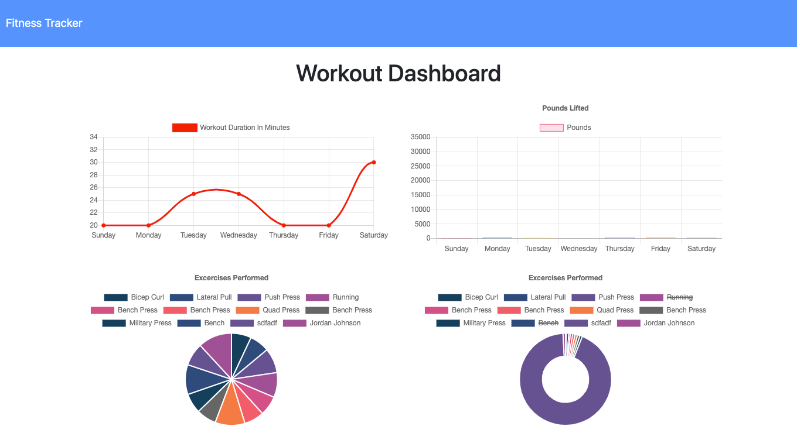

<h1>Workout-Tracker!</h1>

<h1>User Story</h1>
As a user, I want to be able to view create and track daily workouts. I want to be able to log multiple exercises in a workout on a given day. I should also be able to track the name, type, weight, sets, reps, and duration of exercise. If the exercise is a cardio exercise, I should be able to track my distance traveled.

<h1>Table of Contents</h1>

<ul>
<li><a href="#installation">Installation</a></li>
<li><a href="#usage">Usage</a></li>
<li><a href="#contributing">Contributing</a></li>
<li><a href="#support">Support</a></li>
<li><a href="#license">License</a></li>
</ul>

<h1>Installation</h1>

<strong>Technologies: MongoDb, Mongoose, Nosql, Express, HTML5, CSS, JavaScript</strong>
<h2>Clone or Download</h2>
<ul>
<li>Clone or download this repo to your local machine</li>
</ul>
<h2>Setup</h2>
<ul>
  <li> Make sure you have MongoDB installed</li>
  <li> Open a terminal and start MongoDB</li>
  <li> Open another terminal and navigate into the root directory of the project folder.</li>
  <li> Use this command to download packages:<code>npm i</code></li>
  <li> Insert seed files with the command:<code>node seeders/seed.js</code></li>
</ul>

<h2>Run it!</h2>
<ul>
<li>Run the application by entering <code>npm start</code></li>
</ul>

<h1>Usage</h1>

<h1>Contributing</h1>

<strong>Instructions</strong>

<ul>
<li>

Fork or Clone repo to your local machine

</li>
<li>

HACK AWAY!

</li>
<li>

Create a new pull request

</li>
</ul>

<h1>Support</h1>

Contact me with any questions! =]
<h1>License</h1>

<ul>
<li>License: MIT</li>
</ul>
